Our Mirror
================

## Shambhala colours

Here are Shambhala’s standard colors:

- “\#333333” - Thunder
- “\#048032” - Fun Green
- “\#CA1226” - Crimson
- “\#FFBB01” - Selective Yellow
- “\#003780” - Resolution Blue

Let’s combine them into a vector for easier use across plots:

``` r
shambhala_full_colors <- c("Thunder" = "#333333",
                           "Green" = "#048032",
                           "Crimson" = "#CA1226",
                           "Yellow" = "#FFBB01",
                           "Blue" = "#003780")

monochromeR::view_palette(shambhala_full_colors)
```

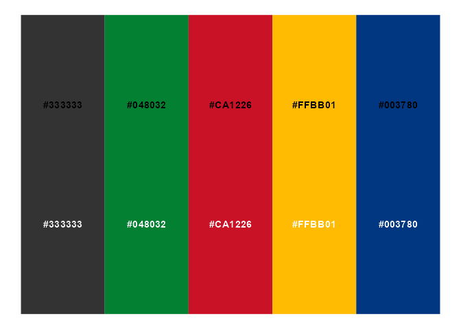<!-- -->

In addition, the website uses the following colors:

``` r
shambhala_full_colors <- c(shambhala_full_colors,
                      "Light Blue" = "#7EB8DF",
                      "Navy Text" = "#003366",
                      "Dark Text" = "#3F3122")

monochromeR::view_palette(shambhala_full_colors)
```

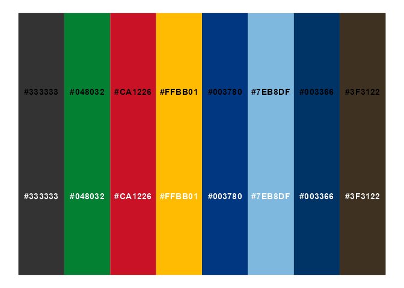<!-- -->

### Streamlining the colours used for text

I suggest dropping the last two colours (used for text on the website),
and instead using the following colors in the plots and on the website,
which are based on the light blue and the thunder color.

``` r
shambhala_palette <- c("Light Text" = "#516877", # to be used for axes, text that is less important
                      "Header Text" = "#303E47", # To be used for headers on the website
                      "Dark Text" = "#101417") # To be used in plot descriptions and the body of the text on the website
```

### Streamlining the colours used for visualisations

To create a unifying theme across all the visualisations, regardless of
which colors are used, we will use the text colors above. In addition,
we can use a related color for grid lines:

``` r
shambhala_palette <- c("Light Text" = "#516877", # to be used for axes, text that is less important
                      "Header Text" = "#303E47", # To be used for headers on the website
                      "Dark Text" = "#101417",
                      "Grid" = "#F5F6F7")
```

To add a sense of unity across the visualisations and the web page, I
have blended in a bit of the light blue with all of the bold colors.
Here is the outcome:

``` r
shambhala_palette <- c("Light Text" = "#516877", # to be used for axes, text that is less important
                      "Header Text" = "#303E47", # To be used for headers on the website
                      "Dark Text" = "#101417",
                      "Grid" = "#F5F6F7",
                      "Green" = "#5AA678",
                      "Crimson" = "#D16471",
                      "Yellow" = "#F1C95B",
                      "Blue" = "#587AA7")

monochromeR::view_palette(shambhala_palette)
```

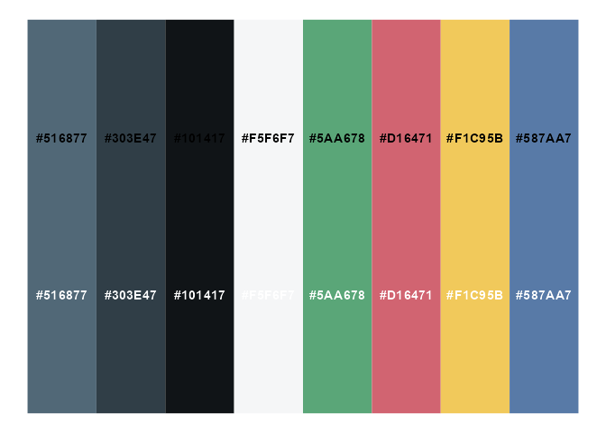<!-- -->

Within each data visualisation, I suggest using only one key color from
your bold palette, or maybe two max, but they do now work nicely
together:

``` r
library(tidyverse)
```

    ## Warning: package 'tidyverse' was built under R version 4.1.3

    ## -- Attaching packages --------------------------------------- tidyverse 1.3.2 --
    ## v ggplot2 3.3.6     v purrr   0.3.4
    ## v tibble  3.1.8     v dplyr   1.0.9
    ## v tidyr   1.1.4     v stringr 1.4.0
    ## v readr   2.1.1     v forcats 0.5.1

    ## Warning: package 'ggplot2' was built under R version 4.1.3

    ## Warning: package 'tibble' was built under R version 4.1.3

    ## Warning: package 'dplyr' was built under R version 4.1.3

    ## -- Conflicts ------------------------------------------ tidyverse_conflicts() --
    ## x dplyr::filter() masks stats::filter()
    ## x dplyr::lag()    masks stats::lag()

``` r
palmerpenguins::penguins %>%
  group_by(species, island) %>%
  count() %>%
  ggplot() +
  geom_col(aes(x = n, group = species, 
               fill = species,
               y = island)) +
  scale_fill_manual(values = c(shambhala_palette[["Green"]], 
                               shambhala_palette[["Blue"]], 
                               shambhala_palette[["Yellow"]])) +
  theme_minimal()
```

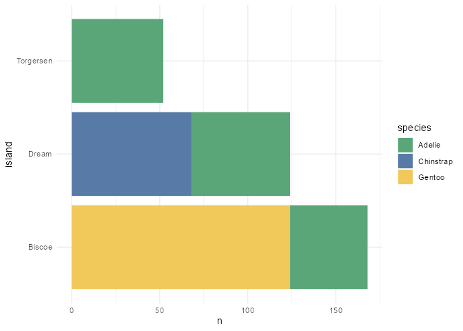<!-- -->

``` r
palmerpenguins::penguins %>%
  group_by(species, island) %>%
  count() %>%
  ggplot() +
  geom_col(aes(x = n, group = species, 
               fill = species,
               y = island)) +
  scale_fill_manual(values = c(shambhala_palette[["Yellow"]], 
                               shambhala_palette[["Blue"]], 
                               shambhala_palette[["Crimson"]])) +
  theme_minimal()
```

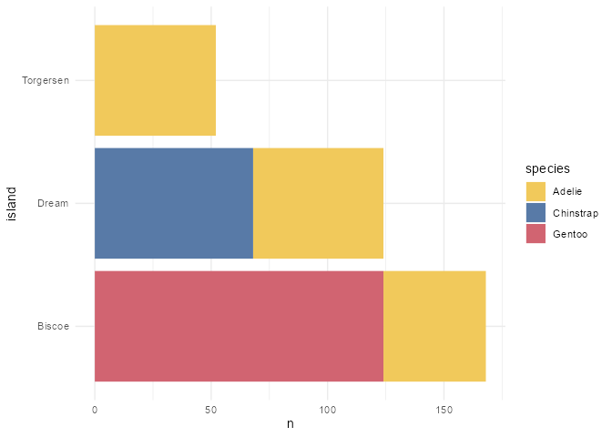<!-- -->

Try to apply the colours semantically. For “NA” equivalents (e.g. “Don’t
know”, “Not specified”, etc), use the `Light Text` colour. For
sentiments heading in that direction (“neutral” on a likert scale),
blend your key colour with the Grid color:

``` r
palmerpenguins::penguins %>%
  group_by(species, island) %>%
  count() %>%
  ggplot() +
  geom_col(aes(x = n, group = species, 
               fill = species,
               y = island)) +
  scale_fill_manual(values = monochromeR::generate_palette(shambhala_palette[["Green"]],
                                                           blend_colour = shambhala_palette[["Grid"]],
                                                           n_colours = 3)) +
  theme_minimal() 
```

    ## 
    ## Because you supplied a blend_colour, the modification variable is set to "blend".
    ## To use other modification options ("go_darker", "go_lighter" or "go_both_ways"),
    ## leave blend_colour as NULL.

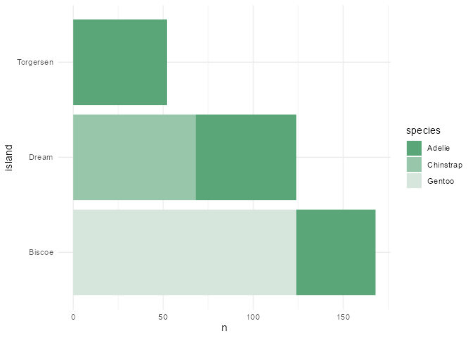<!-- -->

And make the most of transparency and size for comparing this year to
last year, rather than using a different color. See these two plots for
why.

``` r
palmerpenguins::penguins %>%
  filter(island %in% c("Biscoe", "Dream")) %>%
  ggplot() +
  geom_point(aes(x = bill_length_mm,
                 y = bill_depth_mm, 
                 color = island)) +
  labs("Using color to differentiate") +
  scale_color_manual(values = c(shambhala_palette[["Green"]], 
                               shambhala_palette[["Blue"]])) +
  theme_minimal() 
```

    ## Warning: Removed 1 rows containing missing values (geom_point).

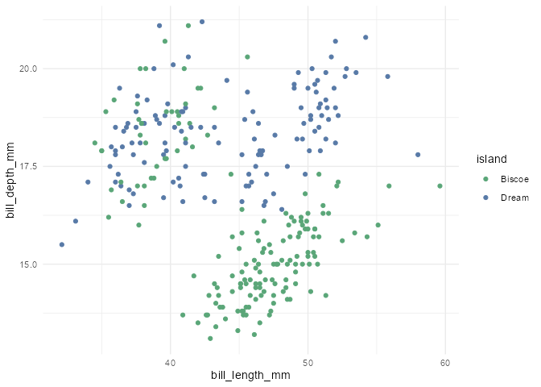<!-- -->

``` r
palmerpenguins::penguins %>%
  filter(island %in% c("Biscoe", "Dream")) %>%
  ggplot() +
  geom_point(aes(x = bill_length_mm,
                 y = bill_depth_mm, 
                 size = island, 
                 alpha = island),
             color = shambhala_palette[["Blue"]]) +
  scale_alpha_discrete(range = c(0.3, 0.9)) +
  labs("Using alpha and size to differentiate") +
  theme_minimal() 
```

    ## Warning: Using alpha for a discrete variable is not advised.

    ## Warning: Using size for a discrete variable is not advised.

    ## Warning: Removed 1 rows containing missing values (geom_point).

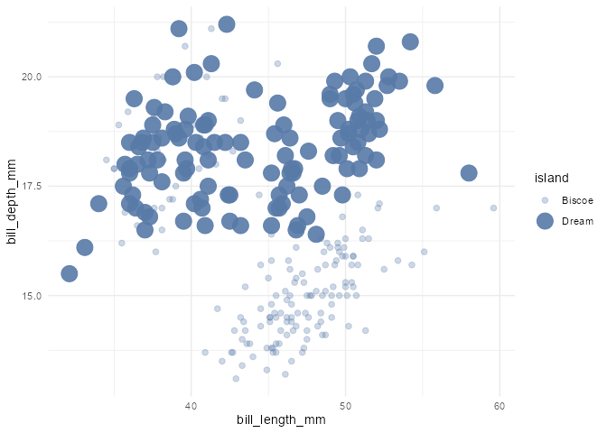<!-- -->

Positive to negative colour options:

``` r
monochromeR::generate_palette("#587AA7", "go_lighter", n_colours = 3, view_palette = TRUE)
```

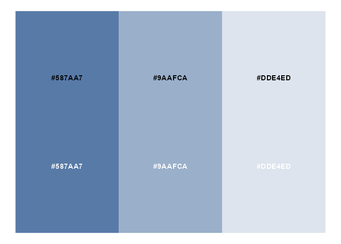<!-- -->

    ## [1] "#587AA7" "#9AAFCA" "#DDE4ED"

``` r
monochromeR::generate_palette("#5AA678", "go_lighter", n_colours = 3, view_palette = TRUE)
```

<!-- -->

    ## [1] "#5AA678" "#9CC9AE" "#DEEDE4"

``` r
monochromeR::generate_palette("#DEEDE4", blend_colour = "#DDE4ED", n_colours = 3, view_palette = TRUE)
```

    ## 
    ## Because you supplied a blend_colour, the modification variable is set to "blend".
    ## To use other modification options ("go_darker", "go_lighter" or "go_both_ways"),
    ## leave blend_colour as NULL.

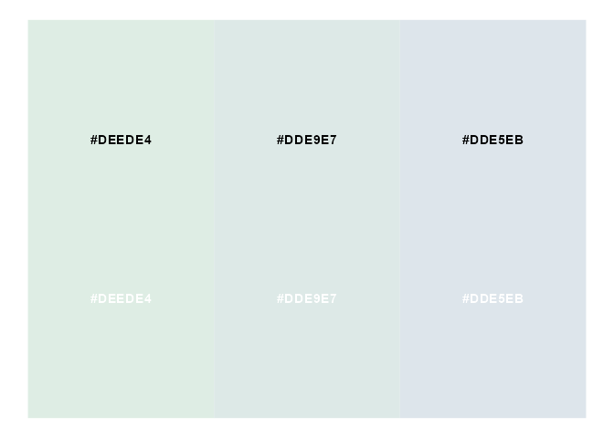<!-- -->

    ## [1] "#DEEDE4" "#DDE9E7" "#DDE5EB"

``` r
pos_neg <- c("#587AA7", "#9AAFCA", "#DDE9E7", "#9CC9AE", "#5AA678")

monochromeR::view_palette(pos_neg)
```

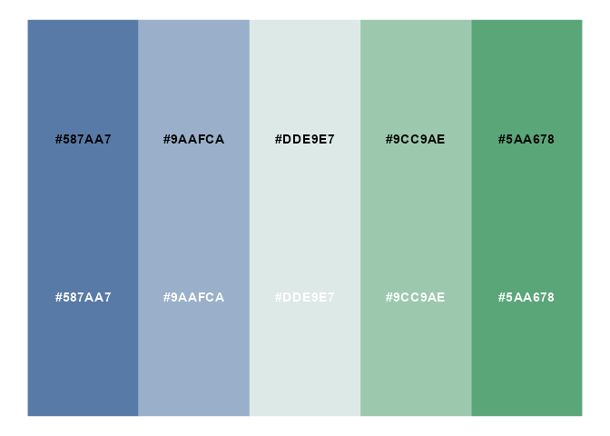<!-- -->

### Applying these within `mirror_theme()`

I have adapted the theme code to bring in the fonts from the rest of the
website, the text colours discussed above, and the grid line color. Here
are the original plots:

``` r
palmerpenguins::penguins %>%
  group_by(species, island) %>%
  count() %>%
  ggplot() +
  geom_col(aes(x = n, group = species, 
               fill = species,
               y = island)) +
    labs(title = "Here are some penguins who live on different islands",
       subtitle = "The Adelies are everywhere!") +
  scale_fill_manual(values = monochromeR::generate_palette(shambhala_palette[["Green"]],
                                                           blend_colour = shambhala_palette[["Grid"]],
                                                           modification = "blend",
                                                           n_colours = 3)) +
  theme_minimal() 
```

    ## 
    ## Because you supplied a blend_colour, the modification variable is set to "blend".
    ## To use other modification options ("go_darker", "go_lighter" or "go_both_ways"),
    ## leave blend_colour as NULL.

<!-- -->

``` r
palmerpenguins::penguins %>%
  group_by(species, island) %>%
  count() %>%
  ggplot() +
  geom_col(aes(x = n, group = species, 
               fill = species,
               y = island)) +
  scale_fill_manual(values = c(shambhala_palette[["Yellow"]], 
                               shambhala_palette[["Blue"]], 
                               shambhala_palette[["Crimson"]])) +
  labs(title = "Here are some penguins who live on different islands",
       subtitle = "The Adelies are everywhere!") +
  theme_minimal()
```

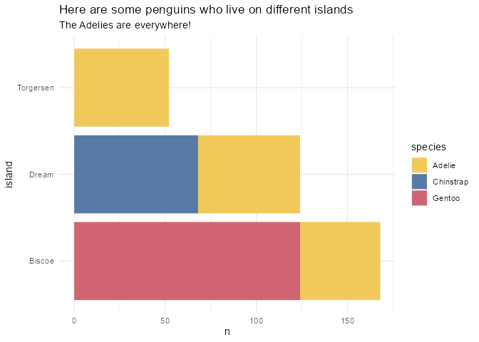<!-- -->

And they are again with the theme:

``` r
palmerpenguins::penguins %>%
  group_by(species, island) %>%
  count() %>%
  ggplot() +
  geom_col(aes(x = n, group = species, 
               fill = species,
               y = island)) +
  scale_fill_manual(values = c(shambhala_palette[["Yellow"]], 
                               shambhala_palette[["Blue"]], 
                               shambhala_palette[["Crimson"]])) +
  labs(title = "Here are some penguins who live on different islands",
       subtitle = "The Adelies are everywhere!") +
  mirror_theme()
```

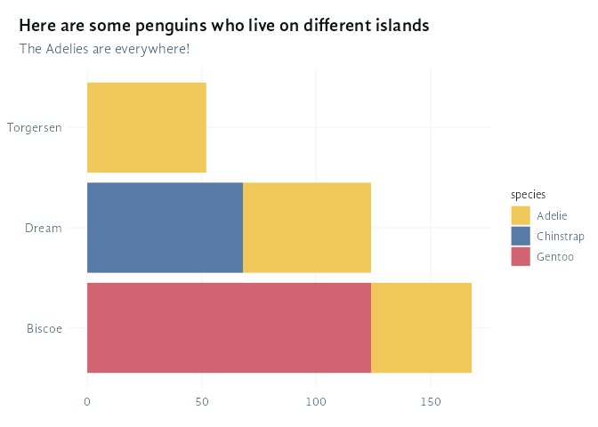<!-- -->

``` r
palmerpenguins::penguins %>%
  group_by(species, island) %>%
  count() %>%
  ggplot() +
  geom_col(aes(x = n, group = species, 
               fill = species,
               y = island)) +
    labs(title = "Here are some penguins who live on different islands",
       subtitle = "The Adelies are everywhere!") +
  scale_fill_manual(values = monochromeR::generate_palette(shambhala_palette[["Green"]],
                                                           blend_colour = shambhala_palette[["Grid"]],
                                                           modification = "blend",
                                                           n_colours = 3)) +
  mirror_theme() 
```

    ## 
    ## Because you supplied a blend_colour, the modification variable is set to "blend".
    ## To use other modification options ("go_darker", "go_lighter" or "go_both_ways"),
    ## leave blend_colour as NULL.

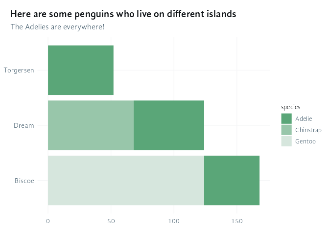<!-- -->
